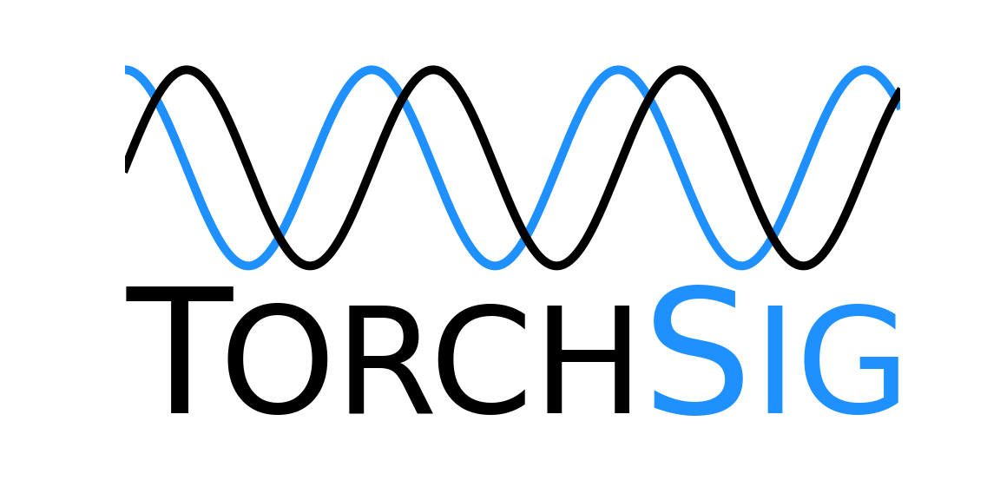

<a align="center" href="https://torchsig.com">
    <picture>
        <source media="(prefers-color-scheme: dark)" srcset="docs/torchsig_logo_white_dodgerblue.png">
        
    </picture>
</a>

-----

[TorchSig](https://torchsig.com) is an open-source signal processing machine learning toolkit based on the PyTorch data handling pipeline. The user-friendly toolkit simplifies common digital signal processing operations, augmentations, and transformations when dealing with both real and complex-valued signals. TorchSig streamlines the integration process of these signals processing tools building on PyTorch, enabling faster and easier development and research for machine learning techniques applied to signals data, particularly within (but not limited to) the radio frequency domain. An example dataset, Narrowband, based on many unique communication signal modulations is included to accelerate the field of modulation classification. Additionally, an example wideband dataset, Wideband, is also included that extends TorchSigNarrowband with larger data example sizes containing multiple signals enabling accelerated research in the fields of wideband signal detection and recognition.

# Getting Started

## Prerequisites
- Ubuntu &ge; 22.04
- Hard drive storage with 1 TB
- CPU with &ge; 4 cores
- GPU with &ge; 16 GB storage (recommended)
- Python &ge; 3.10

We highly reccomend Ubuntu or using a Docker container.

## Installation
Clone the `torchsig` repository and install using the following commands:
```
git clone https://github.com/TorchDSP/torchsig.git
cd torchsig
pip install -e .
```
 
# Examples and Tutorials

TorchSig has a series of Jupyter notebooks in the `examples/` directory. View the README inside `examples/` to learn more.

# Docker
One option for running TorchSig is within Docker. Start by building the Docker container:

```
docker build -t torchsig -f Dockerfile .
```

To run with GPU support use `--gpus all`:
```
docker run -d --rm --network=host --shm-size=32g --gpus all --name torchsig_workspace torchsig tail -f /dev/null
```

To run without GPU support:
```
docker run -d --rm --network=host --shm-size=32g --name torchsig_workspace torchsig tail -f /dev/null
```

Run Jupyter Lab:
```
docker exec torchsig_workspace jupyter lab --allow-root --ip=0.0.0.0 --no-browser
```

To start an interactive shell:
```
docker exec -it torchsig_dev bash
```

Then use the URL in the output in your browser to run the examples and notebooks.


# Key Features
TorchSig provides many useful tools to facilitate and accelerate research on signals processing machine learning technologies:
- The Narrowband datasets is a state-of-the-art static modulations-based RF dataset meant to serve as the next baseline for RFML classification development & evaluation.
- The Wideband datasets is a state-of-the-art static wideband RF signals dataset meant to serve as the baseline for RFML signal detection and recognition development & evaluation.
- Numerous signals processing transforms enable existing ML techniques to be employed on the signals data, streamline domain-specific signals augmentations in signals processing machine learning experiments, and signals-specific data transformations to speed up the field of expert feature signals processing machine learning integration.
- TorchSig also includes a model API similar to open source code in other ML domains, where several state-of-the-art convolutional and transformer-based neural architectures have been adapted to the signals domain and pretrained on the Narrowband and Wideband datasets. These models can be easily used for follow-on research in the form of additional hyperparameter tuning, out-of-the-box comparative analysis/evaluations, and/or fine-tuning to custom datasets.

## Classes
- The `Signal` class and its `SignalMetadata` objects enable signals objects and metadata to be seamlessly handled and operated on throughout the TorchSig infrastructure.
- The `NewDataset` class synthetically creates, augments, and transforms the largest communications signals modulations dataset to date in a generic, flexible fashion.
  - Can generate samples infinitely, however you cannot access previously generated samples (only temporarily stored in memory).
  - Use `NewNarrowband` and `NewWideband` for Narrowband and Wideband,respectively.
- The `DatasetCreator` class allows writing a `NewDataset` object to disk. Use to load the dataset back in later.
- The `StaticDataset` class allows for loading a datataset from disk back into memory.
  - Can access previosly generated samples.
  - `StaticNarrowband` and `StaticWideband` are subclasses to be used.


# Documentation
Documentation can be found [online](https://torchsig.readthedocs.io/en/latest/) or built locally by following the instructions below.
```
cd docs
pip install -r docs-requirements.txt
make html
firefox build/html/index.html
```


# License
TorchSig is released under the MIT License. The MIT license is a popular open-source software license enabling free use, redistribution, and modifications, even for commercial purposes, provided the license is included in all copies or substantial portions of the software. TorchSig has no connection to MIT, other than through the use of this license.

# Publications
| Title | Year  | Cite (APA) |
| ----- | ----  | ---------- |
| [TorchSig: A GNU Radio Block and New Spectrogram Tools for Augmenting ML Training](https://events.gnuradio.org/event/24/contributions/628/) | 2024 | Vallance, P., Oh, E., Mullins, J., Gulati, M., Hoffman, J., & Carrick, M. (2024, September). TorchSig: A GNU Radio Block and New Spectrogram Tools for Augmenting ML Training. In Proceedings of the GNU Radio Conference (Vol. 9, No. 1). |
| [Large Scale Radio Frequency Wideband Signal Detection & Recognition](https://doi.org/10.48550/arXiv.2211.10335)| 2022 | Boegner, L., Vanhoy, G., Vallance, P., Gulati, M., Feitzinger, D., Comar, B., & Miller, R. D. (2022). Large Scale Radio Frequency Wideband Signal Detection & Recognition. arXiv preprint arXiv:2211.10335. |
| [Large Scale Radio Frequency Signal Classification](https://doi.org/10.48550/arXiv.2207.09918) | 2022 | Boegner, L., Gulati, M., Vanhoy, G., Vallance, P., Comar, B., Kokalj-Filipovic, S., ... & Miller, R. D. (2022). Large Scale Radio Frequency Signal Classification. arXiv preprint arXiv:2207.09918. |


# Citing TorchSig

Please cite TorchSig if you use it for your research or business.

```bibtext
@misc{torchsig,
  title={Large Scale Radio Frequency Signal Classification},
  author={Luke Boegner and Manbir Gulati and Garrett Vanhoy and Phillip Vallance and Bradley Comar and Silvija Kokalj-Filipovic and Craig Lennon and Robert D. Miller},
  year={2022},
  archivePrefix={arXiv},
  eprint={2207.09918},
  primaryClass={cs-LG},
  note={arXiv:2207.09918}
  url={https://arxiv.org/abs/2207.09918}
}
```
